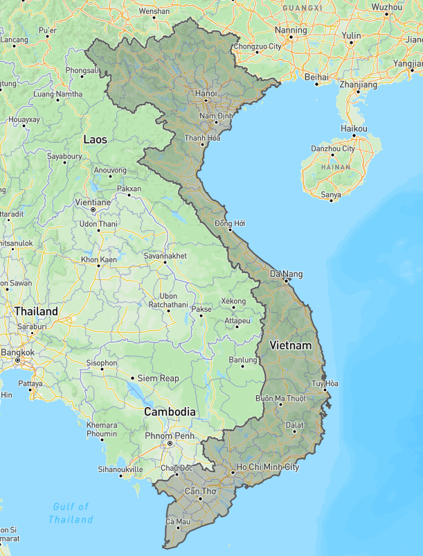
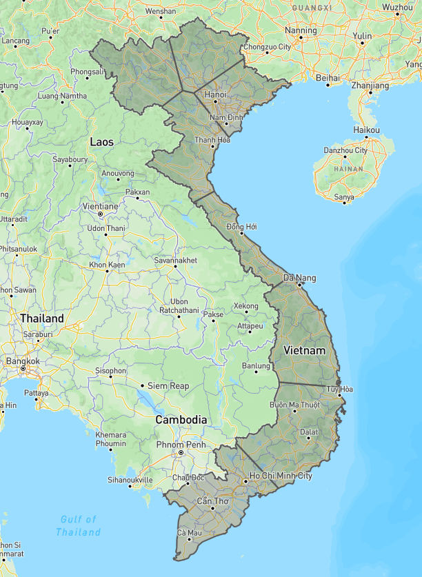

# Hướng dẫn sử dụng
## API Endpoints


### 1. POST `/`
**Tự động chia nhỏ các vùng đa giác (polygon hoặc multipolygon) thành nhiều vùng nhỏ hơn, dựa trên số lượng vùng mong muốn.**

**Mục đích:**
- Sử dụng khi bạn có một hoặc nhiều vùng đa giác lớn (ví dụ: khu vực hành chính, vùng địa lý) và muốn chia nhỏ chúng thành các vùng nhỏ hơn để phục vụ cho các mục đích như phân vùng quản lý, chia cụm dữ liệu, tối ưu hóa hiển thị bản đồ, v.v.
- Số lượng vùng nhỏ có thể điều chỉnh qua thuộc tính `numberOfClusters` trong properties của từng feature (mặc định là 8 nếu không chỉ định).

- **Request:**
  - Body: GeoJSON FeatureCollection. Trong properties của mỗi feature có thể có `numberOfClusters` để chỉ số vùng muốn chia (mặc định là 8 nếu không có).
- **Response:**
  - FeatureCollection với các vùng nhỏ đã được chia.

**Ví dụ:**
```bash
curl --location 'http://localhost:8888' \
--header 'Content-Type: application/json' \
--data '{...}'
```

---


### 2. POST `/split`
**Tách các vùng multipolygon thành các polygon riêng biệt, giúp đơn giản hóa dữ liệu địa lý.**

**Mục đích:**
- Khi bạn có các đối tượng địa lý dạng multipolygon (một feature gồm nhiều polygon rời rạc) và muốn chuyển đổi thành các polygon riêng lẻ để dễ xử lý, hiển thị hoặc phân tích.
- Phù hợp cho các hệ thống chỉ hỗ trợ polygon hoặc cần thao tác từng polygon riêng biệt.

- **Request:**
  - Body: GeoJSON FeatureCollection (có thể chứa polygon hoặc multipolygon)
- **Response:**
  - FeatureCollection chỉ gồm các polygon (mỗi multipolygon sẽ tách thành nhiều polygon)

**Ví dụ:**
```bash
curl --location 'http://localhost:8888/split' \
--header 'Content-Type: application/json' \
--data '{...}'
```

---


### 3. POST `/feature`
**Chia nhỏ một feature (polygon hoặc multipolygon) thành nhiều vùng nhỏ hơn.**

**Mục đích:**
- Khi bạn chỉ muốn chia nhỏ một vùng đa giác cụ thể (không phải cả tập hợp), ví dụ: chia nhỏ một khu vực hành chính, một vùng đất, một khu quy hoạch...
- Kết quả trả về là một FeatureCollection gồm các vùng nhỏ đã được chia từ feature đầu vào.

- **Request:**
  - Body: 1 Feature (GeoJSON)
- **Response:**
  - FeatureCollection các vùng nhỏ

**Ví dụ:**
```bash
curl --location 'http://localhost:8888/feature' \
--header 'Content-Type: application/json' \
--data '{...}'
```

---


### 4. POST `/center`
**Tìm điểm trung tâm (pole of inaccessibility) của một polygon hoặc multipolygon, tức là điểm nằm sâu nhất bên trong vùng đó.**

**Mục đích:**
- Xác định điểm trung tâm hợp lý nhất để đặt nhãn, icon, hoặc làm điểm tham chiếu cho một vùng đa giác trên bản đồ (ví dụ: đặt tên xã/phường, vị trí trung tâm dịch vụ, v.v.).
- Đảm bảo điểm trả về luôn nằm trong vùng, không bị lệch ra ngoài như centroid thông thường.

- **Request:**
  - Body: 1 Feature (GeoJSON)
- **Response:**
  - `{ "lng": ..., "lat": ... }` hoặc `{ "error": "Không tìm được" }`

**Ví dụ:**
```bash
curl --location 'http://localhost:8888/center' \
--header 'Content-Type: application/json' \
--data '{...}'
```

---

## Checkout về
```
git clone git@github.com:thanhnghiacntt/service-split-polygon.git
```
## Cài đặt module
```
cd service-split-polygon
```
```
npm install
```
```
node server.js
```
## Test bằng postman
Body là geojson, numberOfClusters trong properties là muốn chia vùng này thành bao nhiêu ô. Nếu không có thì mặc định là 8
### Ví dụ curl trong postman
```
curl --location 'http://localhost:8888' \
--header 'Content-Type: application/json' \
--data '{
  "type": "FeatureCollection",
  "features": [
    {
      "type": "Feature",
      "properties": {
          "numberOfClusters": 10
      },
      "geometry": {
        "type": "Polygon",
        "coordinates": [
          [
            [
              105.77362060546875,
              21.55017532555692
            ],
            [
              105.5511474609375,
              20.797201434307
            ],
            [
              106.1993408203125,
              20.365227537412434
            ],
            [
              106.76239013671875,
              21.189533621502626
            ],
            [
              106.28448486328125,
              21.570610571132665
            ],
            [
              105.77362060546875,
              21.55017532555692
            ]
          ]
        ]
      }
    },
    {
      "type": "Feature",
      "properties": {},
      "geometry": {
        "type": "Polygon",
        "coordinates": [
          [
            [
              105.4193115234375,
              20.161676573791507
            ],
            [
              105.3973388671875,
              19.93720533223859
            ],
            [
              105.029296875,
              19.78738018198621
            ],
            [
              105.46051025390625,
              19.531318700282522
            ],
            [
              106.35589599609375,
              19.91913050246103
            ],
            [
              105.4193115234375,
              20.161676573791507
            ]
          ]
        ]
      }
    }
  ]
}'
```
### Ví dụ về hình ảnh trước và sau khi chia
#### Trước

#### Sau

